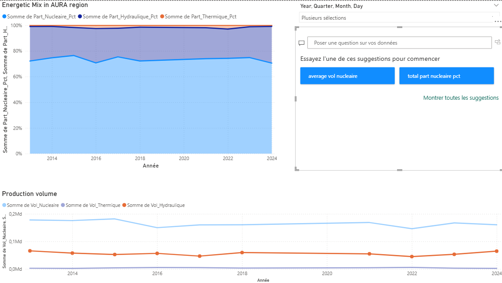

# AURA_Energy_consumption

Project Overview:

This project analyzes the historical evolution of the electricity production mix in the Auvergne-Rhône-Alpes (AURA) region, France. Using  data from RTE France (éco2mix), the study covers over a decade of energy data to identify shifts in generation sources, seasonal trends, and the regional reliance on specific energy types.

Objectives:

- Calculate the monthly percentage of Nuclear, Thermal, and Hydraulic power within the total regional output.

- Observe the stability and changes in the energy mix from January 2013 to December 2024.

- Clean and process raw CSV exports from RTE into a structured SQLite database for efficient querying.

Data Source

Provider: RTE France - éco2mix

Scope: Regional (AURA)

Period: 2013 – 2024

Format: CSV processed via SQLite, data vizualisation in Power BI

Technical Implementation
The core analysis is performed via SQL, calculating monthly aggregates and calculating the relative share of each energy source while handling potential null values to ensure statistical accuracy.

Key Metrics Tracked:

- Vol_Total_Prod: Aggregate of all generation sources (Nuclear, Thermal, Hydro, Wind, Solar, Bioenergy).

- Part_Nucleaire_Pct: Relative share of nuclear energy (the backbone of the AURA grid).

- Part_Hydraulique_Pct: Tracking the impact of regional geography on the energy mix.


--------- SQL Logic Breakdown ---------


The query uses a CTE (Common Table Expression) named Monthly_Production to pre-calculate totals before computing percentages. This ensures better performance and cleaner code.

WITH Monthly_Production AS (...): Defines a temporary result set (CTE) to handle raw aggregations.

substr("Date", 1, 7) AS Mois_Annee: Extracts the year and month (YYYY-MM) from the date string to group the data chronologically.

SUM("Source (MW)"): Aggregates the power generation for each energy type (Nuclear, Thermal, Hydro, etc.) for that specific month.

Vol_Total_Prod: Sums all individual generation sources to create a denominator for market share calculations.

WHERE ... BETWEEN '2013' AND '2024': Filters the dataset to a specific 11-year window, ensuring data consistency.

GROUP BY Mois_Annee: Collapses the granular (usually half-hourly) RTE data into a single row per month.

NULLIF(Vol_Total_Prod, 0): A safety measure. If total production is zero (missing data), it returns NULL instead of crashing the query with a "Division by Zero" error.

ROUND((... * 100.0) / ..., 1): Calculates the percentage share of each energy source, rounded to one decimal place. The 100.0 forces floating-point math for precision.

ORDER BY Mois_Annee: Ensures the final output is sorted from the oldest to the most recent month.


--------- SQL Query ---------
```sql
WITH Monthly_Production AS (
    SELECT 
        substr("Date", 1, 7) AS Mois_Annee,
        SUM("Nucléaire (MW)") AS Vol_Nucleaire,
        SUM("Thermique (MW)") AS Vol_Thermique,
        SUM("Hydraulique (MW)") AS Vol_Hydraulique,
        SUM("Eolien (MW)") AS Vol_Eolien,
        SUM("Solaire (MW)") AS Vol_Solaire,
        SUM("Bioénergies (MW)") AS Vol_Bio,
        (SUM("Nucléaire (MW)") + SUM("Thermique (MW)") + SUM("Hydraulique (MW)") + 
         SUM("Eolien (MW)") + SUM("Solaire (MW)") + SUM("Bioénergies (MW)")) AS Vol_Total_Prod
    FROM RTE_Data
    WHERE substr("Date", 1, 4) BETWEEN '2013' AND '2024'
    GROUP BY Mois_Annee
)
SELECT 
    Mois_Annee,
    Vol_Nucleaire,
    Vol_Thermique,
    Vol_Hydraulique,
    Vol_Total_Prod,
    ROUND((Vol_Nucleaire * 100.0) / NULLIF(Vol_Total_Prod, 0), 1) AS Part_Nucleaire_Pct,
    ROUND((Vol_Thermique * 100.0) / NULLIF(Vol_Total_Prod, 0), 1) AS Part_Thermique_Pct,
    ROUND((Vol_Hydraulique * 100.0) / NULLIF(Vol_Total_Prod, 0), 1) AS Part_Hydraulique_Pct
FROM Monthly_Production
ORDER BY Mois_Annee; 
```


--------- Key findinds with Power BI  ---------





Nuclear energy remains the structural base of the AURA mix, typically accounting for over 70% of total production.

The hydraulic share shows strong seasonality, peaking during spring snowmelts and declining during summer, a critical trend to monitor for regional energy security.

Thermal production correlate inversely with nuclear availability, highlighting its role as the regional "emergency" energy source.


Want to see more ? 

Please download the complete report : [AURA Energy consumption](./AURA_project.pdf)

